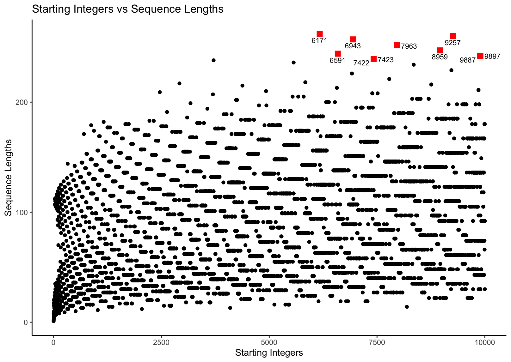
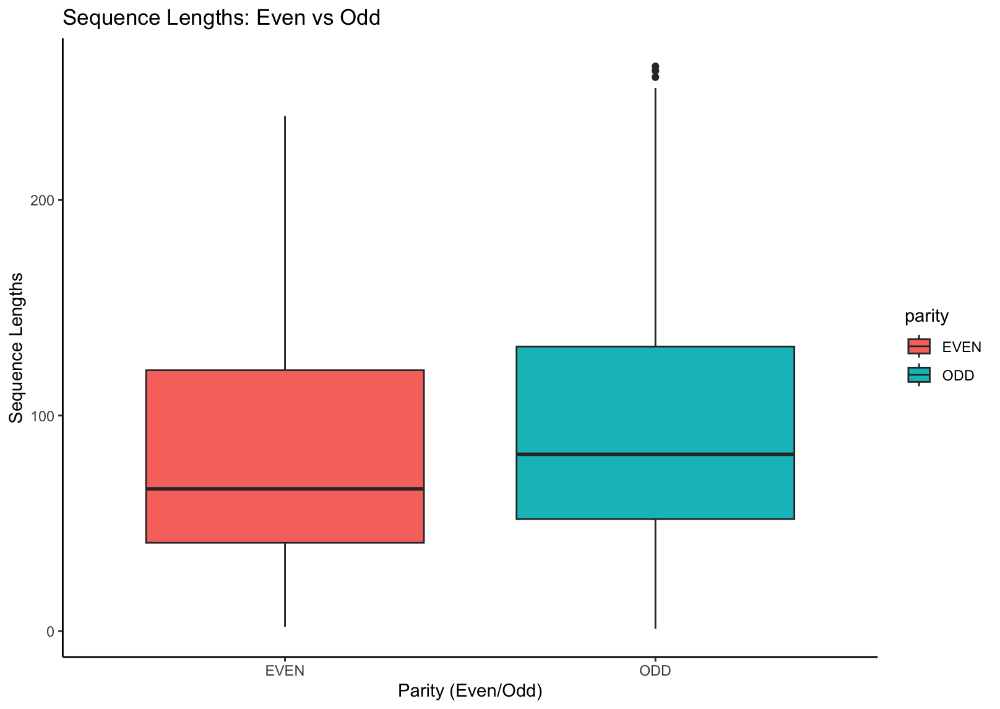

```{r setup, include=FALSE}
knitr::opts_chunk$set(echo = TRUE)
```

## Task 1: Generating The Collatz Conjecture

```{r packages, include=FALSE}
library(tidyverse)
library(ggplot2)
library(ggrepel)
library(dplyr)
```

```{r gen_collatz, include=FALSE}
# accepts a single integer
gen_collatz <- function(n) {
  # Input should all be numerical
  if (is.numeric(n) == FALSE) {
    stop("Invalid input: Not a numerical value")
  }

  # Input should all be integers
  if ((n == as.integer(n)) == FALSE) {
    stop("Invalid input: Not an integer")
  }

  # Input should be 1 or more
  if (n < 1) {
    stop("Invalid input: Value is less than 1")
  }

  # Initialize values
  current <- n
  seq <- c(n)

  # The actual function
  while (current > 1) {
    # check if odd or even
    if (current %% 2 == 0) {
      current <- current / 2
    } else {
      current <- (current * 3) + 1
    }

    # save the new number into the sequence
    seq <- c(seq, current)
  }

  # return the sequence
  return(seq)
}
```

```{r collatz_df, include=FALSE}
collatz_df <- tibble(
  "start" = 1,
  "seq" = list(gen_collatz(1)),
  "length" = length(unlist(seq)),
  "parity" = ifelse((start %% 2) == 0, "EVEN", "ODD"),
  "max_val" = max(unlist(seq))
)

n <- 2

while (n <= 10000) {
  collatz_df <-
    collatz_df %>%
    add_row(
      "start" = n,
      "seq" = list(gen_collatz(n)),
      "length" = length(unlist(seq)),
      "parity" = ifelse((start %% 2) == 0, "EVEN", "ODD"),
      "max_val" = max(unlist(seq))
    )

  n <- n + 1
}
```

```{r collatz_df_result, echo=FALSE}
print(collatz_df)
```

## Task 2: Exploratory Data Analysis

## Task 3: Investigating "Backtracking" In Sequences

### Part 1: backtracks_df

```{r backtrack, include=FALSE}
## function backtrack to check for backtracking
backtrack <- function(x) {
  # initialize
  initial <- x[1]
  current <- 2
  below_init <- FALSE
  above_init <- FALSE

  while (current <= length(x)) {
    # check for when current value is less than initial
    if (x[current] < initial) {
      below_init <- TRUE
    }

    # check for when current value is higher than initial
    # but only after below_init is TRUE
    if ((x[current] > initial) &&
      (below_init == TRUE)) {
      above_init <- TRUE
    }

    # increment current by 1
    current <- current + 1
  }

  # Both must be TRUE to be considered backtracking
  ifelse(below_init & above_init, TRUE, FALSE)
}
```

```{r backtracks_df, include=FALSE}
## doing the actual filtering with the function
backtracks_df <-
  collatz_df %>%
  filter(
    sapply(seq, backtrack)
  )
```

#### Resulting backtracks_df

```{r backtracks_df_result, echo=FALSE}
print(backtracks_df)
```

### Part 2: mode_backtrack

```{r backtrack_count, include=FALSE}
## backtrack count
backtrack_count <- function(x) {
  # initialize
  initial <- x[1]
  current <- 2
  below_init <- FALSE
  above_init <- FALSE
  counter <- 0

  while (current <= length(x)) {
    # check for when current value is less than initial
    if (x[current] < initial &&
      (below_init == FALSE)) {
      below_init <- TRUE
    }

    # check for when current value is higher than initial
    # but only after below_init is TRUE
    if ((x[current] > initial) &&
      (below_init == TRUE) &&
      (above_init == FALSE)) {
      above_init <- TRUE
    }

    # if below_init and above_init is true, add 1 to counter
    # immediately change back the variables to their FALSE state
    if (below_init && above_init) {
      counter <- counter + 1
      below_init <- FALSE
      above_init <- FALSE
    }

    # increment current by 1
    current <- current + 1
  }

  # returns the backtrack count for each sequences
  return(counter)
}
```

```{r mode_calculator, include=FALSE}
mode_calculator <- function(x) {
  # initialize
  unique_nums <- c()
  num_freq <- c()

  # tally the numbers in the freq table
  for (i in x) {
    # If the number in freq is not in unique_nums yet, add to unique_nums
    # also add one to num_freq index that represents the new number (last ind)
    # else, look for index where the number appears on unique_nums
    # and then add 1 to the same index in num_freq
    if ((i %in% unique_nums) == FALSE) {
      unique_nums <- c(unique_nums, i)
      num_freq <- c(num_freq, 1)
    } else {
      index <- which(unique_nums == i)
      num_freq[index] <- num_freq[index] + 1
    }
  }

  # Find the index of the highest frequency
  # then find the number represented by that frequency
  index <- which(num_freq == max(num_freq))
  mode_freq <- unique_nums[index]


  # return the mode
  return(mode_freq)
}
```

```{r mode_backtrack, include=FALSE}
## doing the actual filtering with backtrack_count
mode_backtrack <-
  backtracks_df %>%
  mutate(
    "freq" = sapply(seq, backtrack_count)
  ) %>%
  summarize(
    "mode" = mode_calculator(freq)
  ) %>%
  pull(1)
```

#### Resulting mode_backtrack

```{r mode_backtrack_result, echo=FALSE}
print(mode_backtrack)
```

### Part 3: max_after_backtrack

```{r max_backtrack, include=FALSE}
## function to find the max after first backtrack
max_backtrack <- function(x) {
  # initialize
  initial <- x[1]
  current <- 2
  below_init <- FALSE
  above_init <- FALSE
  max_val <- 0

  while (current <= length(x)) {
    # check for when current value is less than initial
    if (x[current] < initial) {
      below_init <- TRUE
    }

    # check for when current value is higher than initial
    # but only after below_init is TRUE
    if ((x[current] > initial) &&
      (below_init == TRUE)) {
      above_init <- TRUE
    }

    # if below_init and above_init is true, start checking for max_val
    if (below_init && above_init) {
      if (x[current] > max_val) {
        max_val <- x[current]
      }
    }

    # increment current by 1
    current <- current + 1
  }

  # return the max_val
  return(max_val)
}
```

```{r max_after_backtrack, include=FALSE}
## doing the actual filtering with max_after_backtrack
max_after_backtrack <-
  backtracks_df %>%
  mutate(
    "max_backtrack" = sapply(seq, max_backtrack)
  ) %>%
  pull(max_backtrack)
```

#### Resulting max_after_backtrack

```{r max_after_backtrack_result, echo=FALSE}
print(tibble(max_after_backtrack))
```

### Part 4: even_odd_backtrack

```{r even_odd_backtrack, include=FALSE}
## only need to filter by parity
even_odd_backtrack <-
  backtracks_df %>%
  count(parity) %>%
  pull(n)
```

#### Resulting even_odd_backtrack

```{r even_odd_backtrack_result, echo=FALSE}
print(even_odd_backtrack)
```

## Task 4: Visualizations

#### Sequence lengths x Starting integers scatter plot

1.  Objective

-   Create a scatter plot showing the correlation between sequence lengths (y-axis) and starting integers (x-axis).
-   Additionally, we want to find the top 10 starting integers with the longest sequences and highlight them.

2.  How

-   Using the ggplot function to plot the top10integers and collatz_df data sets from tasks 1 and 2, respectively. Adjusting the color, size, and shape of the points brings focus on the top 10 points.
-   Using the geom_text_repel() function to label the top 10 points.

Here's how the plot for this scatter plot looks like; 

The whole code for this scatter plot can be found in [04-plots.R](04-plots.R) in Q1.

#### Highest Sequence Value x Starting integers scatter plot

1.  Objective

-   Similar to question 1, but with a relationship between the starting integers (x-axis) and the highest sequence value (y-axis).

2.  How

-   By using the ggplot function.
-   The scatter plot's top 10 beginning integers with the highest sequence value were given a distinct color that made them stand out. As a result, it is simpler to find and examine these individual data points.

Here's how the plot for this scatter plot looks like; 

The whole code for this scatter plot can be found in [04-plots.R](04-plots.R) in Q2.

#### Even x Odd starting integers box plot

1.  Objective

-   To visually examine and compare the distributional characteristics of sequence lengths for even and odd starting integers in order to gain insights into their behavior and properties.

2.  How

-   Similar to questions 1 and 2, make a box plot using ggplot for each category (even and odd).
-   In these box plots, the y-axis represents the distribution of sequence lengths, and the x-axis the parity (even and odd).

Here's how the plot for this scatter plot looks like; 

The whole code for this scatter plot can be found in [04-plots.R](04-plots.R) in Q3.

These are the few differences that I can notice based on my observations.

1.  **Overlap and Variability:**
    -   The distribution of sequence lengths for even and odd starting integers shows a significant overlap, indicating that there is a wide range of sequence lengths for both groups.
    -   Even starting integers exhibit a broader range of sequence lengths, suggesting greater variability compared to odd starting integers.
2.  **Median length:**
    -   The lower position of the median line (inside the box) for even integers compared to odd integers suggests that, on average, sequences starting with even integers tend to be shorter.
3.  **Similar average length:**
    -   Despite the lower median line for even integers, you've noted that the difference in average sequence length between even and odd starting integers is not substantial. In other words, both groups tend to have sequences of roughly similar average lengths.

## Task 5: Open-ended Exploration

### Question

> What is the distribution of even and odd numbers in Collatz sequences?

We will explore the Collatz Conjecture to understand the distributions of odd and even numbers within these sequences. Specifically, we want to estimate if there are patterns or trends related to the occurrence of odd and even numbers across different starting integers and visualize these distributions using R. Additionally, we also want to explore whether there is a relationship between even and odd numbers in terms of their ratio.

### Methodology

-   Generate `collatz_sequence` using an existing data frame `collatz_df` from previous tasks by initialization.
-   Wrangle the data to identify `Even` and `Odd` numbers in each sequence and calculate the ratio of even to odd numbers (`Even_Odd_Ratio`).
-   Summarize statistics for even and odd numbers (`EvenOdd_Avg_Max`) and the `Even_Odd_Ratio` (`Ratio_Avg_Max`) separately.
-   Calculate the average and maximum values for `Even` and `Odd` numbers.
-   Calculate the average and maximum values for the `Even_Odd_Ratio`.

```{r Task_5, include=FALSE}

#### Below is the Rcode used to answer our question

# Initialize
collatz_sequence <- collatz_df

# Wrangle the data to identify odd and even numbers in each sequence and Calculate the ratio
collatz_sequence <- collatz_sequence %>%
  mutate(
    Even = sapply(seq, function(x) {
      sum(x %% 2 == 0)
    }),
    Odd = sapply(seq, function(x) {
      sum(x %% 2 == 1)
    }),
    Even_Odd_Ratio = Even / Odd
  )

# Summarize statistics for Even, Odd and Even_Odd_Ratio
EvenOdd_Avg_Max <- collatz_sequence %>%
  gather(key = "type", value = "value", Even, Odd) %>%
  group_by(type) %>%
  summarize(
    Average = mean(value),
    Maximum = max(value)
  )

Ratio_Avg_Max <- collatz_sequence %>%
  gather(key = "type", value = "value", Even_Odd_Ratio) %>%
  group_by(type) %>%
  summarize(
    Average = mean(value),
    Maximum = max(value)
  )
```

### Findings

By analyzing the Collatz sequences based from our Rcode above, we discovered the following results:-

1.  **Counts of Even and Odd Numbers**
    -   The analysis revealed that in Collatz Conjecture sequences, there is a distribution of both even and odd numbers.
    -   The distribution shows that there are more even numbers compared to odd numbers (refer to [7.5.1 Counts of Odd & Even Numbers in Collatz Sequences](https://github.com/sm2302-aug23/grp-r-superfectagoras#751-counts-of-odd--even-numbers-in-collatz-sequences)).
    -   The sum of both even and odd numbers individually from the respective sequences is computed.
2.  **Even-Odd Ratio**
    -   The calculated `Even_Odd_Ratio` for each sequence varies individually but almost uniformly.
    -   Such analysis can provide information about the average and maximum `Even_Odd_Ratio` observed in the Collatz sequences.
    -   If this result is visualized in a graph, one can see that it is mostly likely to showcase uniformity.
3.  **Summary Statistics**
    -   The summary statistics show the average and maximum counts for even and odd numbers (`EvenOdd_Avg_Max`), and even-odd ratios (`Ratio_Avg_Max`) in the sequences.
    -   This information helps in understanding the central tendency and variability of even and odd numbers, even if there is a slight variance.

#### Below are the results obtained after the Rcode computational run

##### Part 1: Collatz Sequence Table

```{r collatz_sequence, echo=FALSE}
print(collatz_sequence)
```

##### Part 2: Summary Statistics for Even and Odd Numbers Table

```{r EvenOdd_Avg_Max, echo=FALSE}
print(EvenOdd_Avg_Max)
```

##### Part 3: Summary Statistics for Ratio Table

```{r Ratio_Avg_Max, echo=FALSE}
print(Ratio_Avg_Max)
```

### Implications

-   Understanding the distribution of even and odd numbers in Collatz Conjecture sequences can provide insights into the behavior of these sequences and their properties.
-   The variations in even-odd ratios suggest that Collatz sequences exhibit diverse patterns. Further analysis might reveal patterns or characteristics associated with sequences that have high or low even-odd ratios.
-   The summary statistics offer a concise overview of the data, aiding in comparisons and identifying sequences with unusual properties.

### Conclusion

The analysis of Collatz Conjecture sequences reveals that these sequences exhibit a distribution of both even and odd numbers (refer to [7.5.1 Counts of Odd & Even Numbers in Collatz Sequences](https://github.com/sm2302-aug23/grp-r-superfectagoras#751-counts-of-odd--even-numbers-in-collatz-sequences)). The even-to-odd ratio varies across different sequences, with a few sequences having higher ratios than others. This information can contribute to a deeper understanding of the Collatz Conjecture sequences and their patterns.

## Task 6: Creative Visualisation Challenge

## Task 7 : Other Data

### Task 5

#### 7.5.1 Counts of Odd & Even Numbers in Collatz Sequences

```{r collatz_sequence_plot_code, echo=FALSE}
## Explore and visualize the distribution of even and odd numbers
## For example, create a bar chart:
collatz_sequence %>%
  gather(key = "type", value = "count", Odd, Even) %>%
  ggplot(aes(x = type, y = count, fill = type)) +
  geom_bar(stat = "identity") +
  labs(
    title = "Counts of Odd & Even Numbers in Collatz Sequences",
    x = "Number Type",
    y = "Count"
  ) +
  theme_classic()
```

## Contributors

-   **Task 1:** Waqi

-   **Task 2:** Ros

-   **Task 3:** Waqi

-   **Task 4:** Wana

-   **Task 5:** Fizah

-   **Task 6:** Ros

-   **README:** All
