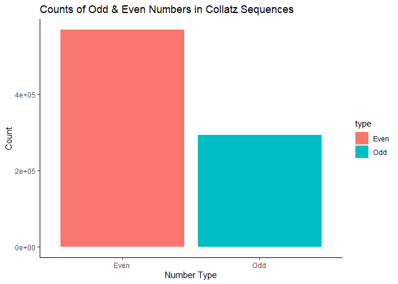

Collatz Conjecture
================

## Task 1: Generating The Collatz Conjecture

    ## # A tibble: 10,000 × 5
    ##    start seq        length parity max_val
    ##    <dbl> <list>      <int> <chr>    <dbl>
    ##  1     1 <dbl [1]>       1 ODD          1
    ##  2     2 <dbl [2]>       2 EVEN         2
    ##  3     3 <dbl [8]>       8 ODD         16
    ##  4     4 <dbl [3]>       3 EVEN         4
    ##  5     5 <dbl [6]>       6 ODD         16
    ##  6     6 <dbl [9]>       9 EVEN        16
    ##  7     7 <dbl [17]>     17 ODD         52
    ##  8     8 <dbl [4]>       4 EVEN         8
    ##  9     9 <dbl [20]>     20 ODD         52
    ## 10    10 <dbl [7]>       7 EVEN        16
    ## # ℹ 9,990 more rows

## Task 2: Exploratory Data Analysis

## Task 3: Investigating “Backtracking” In Sequences

### Part 1: backtracks_df

#### Resulting backtracks_df

    ## # A tibble: 8,229 × 5
    ##    start seq        length parity max_val
    ##    <dbl> <list>      <int> <chr>    <dbl>
    ##  1     6 <dbl [9]>       9 EVEN        16
    ##  2     7 <dbl [17]>     17 ODD         52
    ##  3     9 <dbl [20]>     20 ODD         52
    ##  4    10 <dbl [7]>       7 EVEN        16
    ##  5    11 <dbl [15]>     15 ODD         52
    ##  6    12 <dbl [10]>     10 EVEN        16
    ##  7    13 <dbl [10]>     10 ODD         40
    ##  8    14 <dbl [18]>     18 EVEN        52
    ##  9    15 <dbl [18]>     18 ODD        160
    ## 10    17 <dbl [13]>     13 ODD         52
    ## # ℹ 8,219 more rows

### Part 2: mode_backtrack

#### Resulting mode_backtrack

    ## [1] 1

### Part 3: max_after_backtrack

#### Resulting max_after_backtrack

    ## # A tibble: 8,229 × 1
    ##    max_after_backtrack
    ##                  <dbl>
    ##  1                  16
    ##  2                  16
    ##  3                  52
    ##  4                  16
    ##  5                  16
    ##  6                  16
    ##  7                  16
    ##  8                  52
    ##  9                  16
    ## 10                  40
    ## # ℹ 8,219 more rows

### Part 4: even_odd_backtrack

#### Resulting even_odd_backtrack

    ## [1] 3943 4286

## Task 4: Visualizations

#### Sequence lengths x Starting integers scatter plot

1.  Objective

- Create a scatter plot showing the correlation between sequence lengths
  (y-axis) and starting integers (x-axis).
- Additionally, we want to find the top 10 starting integers with the
  longest sequences and highlight them.

2.  How

- Using the ggplot function to plot the top10integers and collatz_df
  data sets from tasks 1 and 2, respectively. Adjusting the color, size,
  and shape of the points brings focus on the top 10 points.
- Using the geom_text_repel() function to label the top 10 points.

Here’s how the plot for this scatter plot looks like;

The whole code for this scatter plot can be found in
[04-plots.R](04-plots.R) in Q1.

#### Highest Sequence Value x Starting integers scatter plot

1.  Objective

- Similar to question 1, but with a relationship between the
  starting integers (x-axis) and the highest sequence value (y-axis).

2.  How

- By using the ggplot function.
- The scatter plot’s top 10 beginning integers with the highest sequence
  value were given a distinct color that made them stand out. As a
  result, it is simpler to find and examine these individual data
  points.

Here’s how the plot for this scatter plot looks like;

The whole code for this scatter plot can be found in
[04-plots.R](04-plots.R) in Q2.

#### Even x Odd starting integers box plot

1.  Objective

- To visually examine and compare the distributional characteristics of
  sequence lengths for even and odd starting integers in order to gain
  insights into their behavior and properties.

2.  How

- Similar to questions 1 and 2, make a box plot using ggplot for each
  category (even and odd).
- In these box plots, the y-axis represents the distribution of sequence
  lengths, and the x-axis the parity (even and odd).

Here’s how the plot for this scatter plot looks like;

The whole code for this scatter plot can be found in
[04-plots.R](04-plots.R) in Q3.

These are the few differences that I can notice based on my
observations.

1.  **Overlap and Variability:**
    - The distribution of sequence lengths for even and odd starting
      integers shows a significant overlap, indicating that there is a
      wide range of sequence lengths for both groups.
    - Even starting integers exhibit a broader range of sequence
      lengths, suggesting greater variability compared to odd starting
      integers.
2.  **Median length:**
    - The lower position of the median line (inside the box) for even
      integers compared to odd integers suggests that, on average,
      sequences starting with even integers tend to be shorter.
3.  **Similar average length:**
    - Despite the lower median line for even integers, you’ve noted that
      the difference in average sequence length between even and odd
      starting integers is not substantial. In other words, both groups
      tend to have sequences of roughly similar average lengths.

## Task 5: Open-ended Exploration

### Question

> What is the distribution of even and odd numbers in Collatz sequences?

We will explore the Collatz Conjecture to understand the distributions
of odd and even numbers within these sequences. Specifically, we want to
estimate if there are patterns or trends related to the occurrence of
odd and even numbers across different starting integers and visualize
these distributions using R. Additionally, we also want to explore
whether there is a relationship between even and odd numbers in terms of
their ratio.

### Methodology

- Generate `collatz_sequence` using an existing data frame `collatz_df`
  from previous tasks by initialization.
- Wrangle the data to identify `Even` and `Odd` numbers in each sequence
  and calculate the ratio of even to odd numbers (`Even_Odd_Ratio`).
- Summarize statistics for even and odd numbers (`EvenOdd_Avg_Max`) and
  the `Even_Odd_Ratio` (`Ratio_Avg_Max`) separately.
- Calculate the average and maximum values for `Even` and `Odd` numbers.
- Calculate the average and maximum values for the `Even_Odd_Ratio`.

### Findings

By analyzing the Collatz sequences based from our Rcode above, we
discovered the following results:-

1.  **Counts of Even and Odd Numbers**
    - The analysis revealed that in Collatz Conjecture sequences, there
      is a distribution of both even and odd numbers.
    - The distribution shows that there are more even numbers compared
      to odd numbers (refer to [7.5.2 bar
      chart](https://github.com/sm2302-aug23/grp-r-superfectagoras#example-of-bar-chart-visualization-of-the-distribution)).
    - The sum of both even and odd numbers individually from the
      respective sequences is computed.
2.  **Even-Odd Ratio**
    - The calculated `Even_Odd_Ratio` for each sequence varies
      individually but almost uniformly.
    - Such analysis can provide information about the average and
      maximum `Even_Odd_Ratio` observed in the Collatz sequences.
    - If this result is visualized in a graph, one can see that it is
      mostly likely to showcase uniformity.
3.  **Summary Statistics**
    - The summary statistics show the average and maximum counts for
      even and odd numbers (`EvenOdd_Avg_Max`), and even-odd ratios
      (`Ratio_Avg_Max`) in the sequences.
    - This information helps in understanding the central tendency and
      variability of even and odd numbers, even if there is a slight
      variance.

#### Below are the results obtained after the Rcode computational run

##### Part 1: Collatz Sequence Table

    ## # A tibble: 10,000 × 8
    ##    start seq        length parity max_val  Even   Odd Even_Odd_Ratio
    ##    <dbl> <list>      <int> <chr>    <dbl> <int> <int>          <dbl>
    ##  1     1 <dbl [1]>       1 ODD          1     0     1           0   
    ##  2     2 <dbl [2]>       2 EVEN         2     1     1           1   
    ##  3     3 <dbl [8]>       8 ODD         16     5     3           1.67
    ##  4     4 <dbl [3]>       3 EVEN         4     2     1           2   
    ##  5     5 <dbl [6]>       6 ODD         16     4     2           2   
    ##  6     6 <dbl [9]>       9 EVEN        16     6     3           2   
    ##  7     7 <dbl [17]>     17 ODD         52    11     6           1.83
    ##  8     8 <dbl [4]>       4 EVEN         8     3     1           3   
    ##  9     9 <dbl [20]>     20 ODD         52    13     7           1.86
    ## 10    10 <dbl [7]>       7 EVEN        16     5     2           2.5 
    ## # ℹ 9,990 more rows

##### Part 2: Summary Statistics for Even and Odd Numbers Table

    ## # A tibble: 2 × 3
    ##   type  Average Maximum
    ##   <chr>   <dbl>   <int>
    ## 1 Even     56.8     165
    ## 2 Odd      29.2      97

##### Part 3: Summary Statistics for Ratio Table

    ## # A tibble: 1 × 3
    ##   type           Average Maximum
    ##   <chr>            <dbl>   <dbl>
    ## 1 Even_Odd_Ratio    2.18      13

### Implications

- Understanding the distribution of even and odd numbers in Collatz
  Conjecture sequences can provide insights into the behavior of these
  sequences and their properties.
- The variations in even-odd ratios suggest that Collatz sequences
  exhibit diverse patterns. Further analysis might reveal patterns or
  characteristics associated with sequences that have high or low
  even-odd ratios.
- The summary statistics offer a concise overview of the data, aiding in
  comparisons and identifying sequences with unusual properties.

### Conclusion

The analysis of Collatz Conjecture sequences reveals that these
sequences exhibit a distribution of both even and odd numbers (refer to
[7.5.2 bar
chart](https://github.com/sm2302-aug23/grp-r-superfectagoras#example-of-bar-chart-visualization-of-the-distribution)).
The even-to-odd ratio varies across different sequences, with a few
sequences having higher ratios than others. This information can
contribute to a deeper understanding of the Collatz Conjecture sequences
and their patterns.

## Task 6: Creative Visualisation Challenge

## Task 7 : Other Data

### Task 5

#### 7.5.1 Counts of Odd & Even Numbers in Collatz Sequences

<!-- -->

## Contributors

- **Task 1:** Waqi

- **Task 2:** Ros

- **Task 3:** Waqi

- **Task 4:** Wana

- **Task 5:** Fizah

- **Task 6:** Ros

- **README:** All
