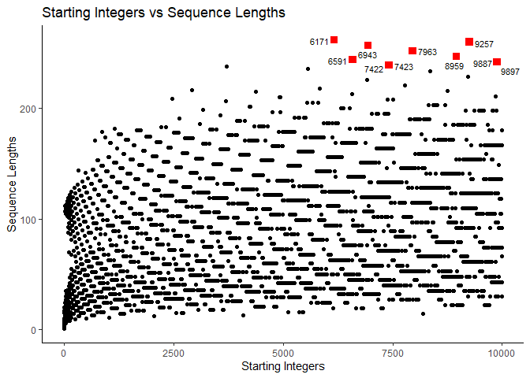
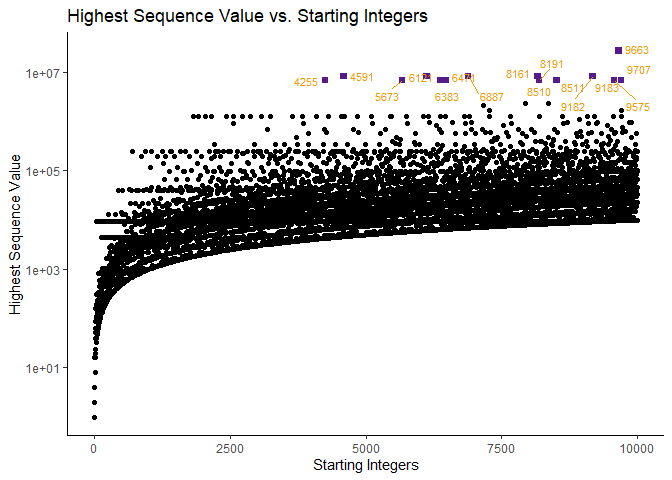
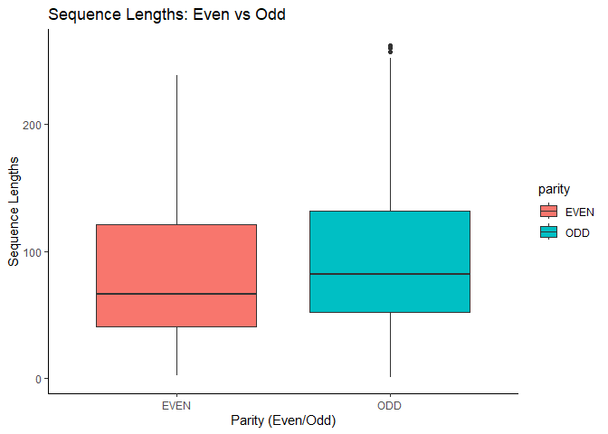

Collatz Conjecture
================

## Task 1: Generating The Collatz Conjecture

    ## # A tibble: 10,000 × 5
    ##    start seq        length parity max_val
    ##    <dbl> <list>      <int> <chr>    <dbl>
    ##  1     1 <dbl [1]>       1 ODD          1
    ##  2     2 <dbl [2]>       2 EVEN         2
    ##  3     3 <dbl [8]>       8 ODD         16
    ##  4     4 <dbl [3]>       3 EVEN         4
    ##  5     5 <dbl [6]>       6 ODD         16
    ##  6     6 <dbl [9]>       9 EVEN        16
    ##  7     7 <dbl [17]>     17 ODD         52
    ##  8     8 <dbl [4]>       4 EVEN         8
    ##  9     9 <dbl [20]>     20 ODD         52
    ## 10    10 <dbl [7]>       7 EVEN        16
    ## # ℹ 9,990 more rows

## Task 2: Exploratory Data Analysis

### Part 1: top10longest

#### Resulting top10longest

    ##  [1] 6171 9257 6943 7963 8959 6591 9887 9897 7422 7423

### Part 2: max_val_int

#### Resulting max_val_int

    ## [1] 9663

### Part 3: even_odd_avg_len and even_odd_sd_len

#### Resulting even_odd_avg_len and even_odd_sd_len

##### even_odd_avg_len

    ## [1] 79.5936 92.3396

##### even_odd_sd_len

    ## [1] 45.10308 47.18387

## Task 3: Investigating “Backtracking” In Sequences

### Part 1: backtracks_df

#### Resulting backtracks_df

    ## # A tibble: 8,229 × 5
    ##    start seq        length parity max_val
    ##    <dbl> <list>      <int> <chr>    <dbl>
    ##  1     6 <dbl [9]>       9 EVEN        16
    ##  2     7 <dbl [17]>     17 ODD         52
    ##  3     9 <dbl [20]>     20 ODD         52
    ##  4    10 <dbl [7]>       7 EVEN        16
    ##  5    11 <dbl [15]>     15 ODD         52
    ##  6    12 <dbl [10]>     10 EVEN        16
    ##  7    13 <dbl [10]>     10 ODD         40
    ##  8    14 <dbl [18]>     18 EVEN        52
    ##  9    15 <dbl [18]>     18 ODD        160
    ## 10    17 <dbl [13]>     13 ODD         52
    ## # ℹ 8,219 more rows

### Part 2: mode_backtrack

#### Resulting mode_backtrack

    ## [1] 1

### Part 3: max_after_backtrack

#### Resulting max_after_backtrack

    ## # A tibble: 8,229 × 1
    ##    max_after_backtrack
    ##                  <dbl>
    ##  1                  16
    ##  2                  16
    ##  3                  52
    ##  4                  16
    ##  5                  16
    ##  6                  16
    ##  7                  16
    ##  8                  52
    ##  9                  16
    ## 10                  40
    ## # ℹ 8,219 more rows

### Part 4: even_odd_backtrack

#### Resulting even_odd_backtrack

    ## [1] 3943 4286

## Task 4: Visualizations

#### Sequence lengths x Starting integers scatter plot

1.  **Objective**

- Create a scatter plot showing the correlation between sequence lengths
  (y-axis) and starting integers (x-axis).
- Additionally, we want to find the top 10 starting integers with the
  longest sequences and highlight them.

2.  **How**

- Using the ggplot function to plot the top10integers and collatz_df
  data sets from tasks 1 and 2, respectively. Adjusting the color, size,
  and shape of the points brings focus on the top 10 points.
- Using the geom_text_repel() function to label the top 10 points.

Here’s how the plot for this scatter plot looks like:
<!-- -->

The whole code for this scatter plot can be found in
[04-plots.R](04-plots.R) in Q1.

#### Highest Sequence Value x Starting integers scatter plot

1.  **Objective**

- Similar to question 1, but with a relationship between the starting
  integers (x-axis) and the highest sequence value (y-axis).

2.  **How**

- By using the ggplot function.
- The scatter plot’s top 10 beginning integers with the highest sequence
  value were given a distinct color that made them stand out. As a
  result, it is simpler to find and examine these individual data
  points.
- Logarithmic scale was used for the y-axis as some of the values ended
  up being much higher than the others, making the rest of the points
  squished at the bottom originally.

Here’s how the plot for this scatter plot looks like:
<!-- -->

The whole code for this scatter plot can be found in
[04-plots.R](04-plots.R) in Q2.

#### Even x Odd starting integers box plot

1.  **Objective**

- To visually examine and compare the distributional characteristics of
  sequence lengths for even and odd starting integers in order to gain
  insights into their behavior and properties.

2.  **How**

- Similar to questions 1 and 2, make a box plot using ggplot for each
  category (even and odd).
- In these box plots, the y-axis represents the distribution of sequence
  lengths, and the x-axis the parity (even and odd).

Here’s how the plot for this scatter plot looks like:
<!-- -->

The whole code for this scatter plot can be found in
[04-plots.R](04-plots.R) in Q3.

These are the few differences that I can notice based on my
observations.

1.  **Overlap and Variability**
    - The distribution of sequence lengths for even and odd starting
      integers shows a significant overlap, indicating that there is a
      wide range of sequence lengths for both groups.
    - Even starting integers exhibit a broader range of sequence
      lengths, suggesting greater variability compared to odd starting
      integers.
2.  **Median length**
    - The lower position of the median line (inside the box) for even
      integers compared to odd integers suggests that, on average,
      sequences starting with even integers tend to be shorter.
3.  **Similar average length**
    - Despite the lower median line for even integers, you’ve noted that
      the difference in average sequence length between even and odd
      starting integers is not substantial. In other words, both groups
      tend to have sequences of roughly similar average lengths.

## Task 5: Open-ended Exploration

### Question

> What is the distribution of even and odd numbers in Collatz sequences?

**Objectives**

- To understand the distributions of odd and even numbers within these sequences.
- To estimate if there are patterns or trends related to the occurrence of
odd and even numbers across different starting integers and visualize
these distributions using R.
- To investigate whether there is a relationship between even and odd numbers in terms of
their ratio.

### Methodology

#### Counts of Even and Odd Numbers

1.  **Objective**

- To calculate the sum of even and odd numbers, respectively, from each sequence.
- To analyse the distribution between the even and odd numbers for comparison.

2.  **How**

- Generate `collatz_sequence` using an existing data frame `collatz_df`.
  from previous tasks by initialization.
- Wrangle the data to identify `Even` and `Odd` numbers in each sequence and then use the mutating function, respectively with the help of `sapply`.

The rcode can be found in [05-open.R](05-open.R) on the wrangling part.

#### Even-Odd Ratio

1.  **Objective**

- To calculate the even-to-odd ratio

2.  **How**

- Introduce the variable as `Even_Odd_Ratio`.
- Then have this variable compute the result by having even numbers divisible by odd numbers.

The rcode can be found in [05-open.R](05-open.R) on the wrangling mutate part.

#### Summary Statistics

1.  **Objective**

- To calculate the average and maximum values for even, odd and even-odd ratio

3.  **How**

- Create variables for even and odd numbers (`EvenOdd_Avg_Max`) and
  the `Even_Odd_Ratio` (`Ratio_Avg_Max`) separately.
- by using the `summarize()` with the help of `gather()` to accurately calculate the average and maximum values for `EvenOdd_Avg_Max` and `Ratio_Avg_Max`.

The rcode can be found in [05-open.R](05-open.R) on the summarize statistics part.

### Findings

The following are the differences noted based on my observations:-

#### Counts of Even and Odd Numbers

- The analysis revealed that there is a significant distribution of both even and odd numbers.
- There are more even total numbers compared to odd total numbers (refer to [7.5.1 Counts of Odd & Even Numbers in Collatz Sequences](https://github.com/sm2302-aug23/grp-r-superfectagoras#751-counts-of-odd--even-numbers-in-collatz-sequences)).
- Such distribution is important because it indicates that a pattern or trend can be further analyzed using the Collatz Conjecture to make comparisons.
- Below is how the column looks:

      ## # A tibble: 10,000 × 8
      ##    start seq        length parity max_val  Even   Odd Even_Odd_Ratio
      ##    <dbl> <list>      <int> <chr>    <dbl> <int> <int>          <dbl>
      ##  1     1 <dbl [1]>       1 ODD          1     0     1           0   
      ##  2     2 <dbl [2]>       2 EVEN         2     1     1           1   
      ##  3     3 <dbl [8]>       8 ODD         16     5     3           1.67
      ##  4     4 <dbl [3]>       3 EVEN         4     2     1           2   
      ##  5     5 <dbl [6]>       6 ODD         16     4     2           2   
      ##  6     6 <dbl [9]>       9 EVEN        16     6     3           2   
      ##  7     7 <dbl [17]>     17 ODD         52    11     6           1.83
      ##  8     8 <dbl [4]>       4 EVEN         8     3     1           3   
      ##  9     9 <dbl [20]>     20 ODD         52    13     7           1.86
      ## 10    10 <dbl [7]>       7 EVEN        16     5     2           2.5 
      ## # ℹ 9,990 more rows

#### Even-Odd Ratio

- We can see that except for starting 1 and 2, it appears that on even starting sequences, the ratio varies individually.
- The calculated `Even_Odd_Ratio` for each sequence varies individually but almost uniformly.
- If this result is visualized in a plot graph, one can tell that it is mostly likely to showcase almost uniformity.
- This indicates that there is a relationship between even and odd numbers in terms of their ratio, as its variations exhibit diverse patterns.
- The results can be seen in the above column.

#### Summary Statistics

- The summary statistics show the average and maximum counts for even and odd numbers (`EvenOdd_Avg_Max`), and even-odd ratios (`Ratio_Avg_Max`).
- This information helps in understanding the central tendency and variability of even, odd and their ratio, even if there is a slight variance.
- The summary statistics offer a concise overview of the data, aiding in comparisons and identifying sequences with unusual properties.
- Below is how the results looks:

##### EvenOdd_Avg_Max

    ## # A tibble: 2 × 3
    ##   type  Average Maximum
    ##   <chr>   <dbl>   <int>
    ## 1 Even     56.8     165
    ## 2 Odd      29.2      97

##### Ratio_Avg_Max

    ## # A tibble: 1 × 3
    ##   type           Average Maximum
    ##   <chr>            <dbl>   <dbl>
    ## 1 Even_Odd_Ratio    2.18      13

### Conclusion

The analysis of Collatz Conjecture sequences reveals that these
sequences exhibit a distribution of both even and odd numbers (refer to
[7.5.1 Counts of Odd & Even Numbers in Collatz
Sequences](https://github.com/sm2302-aug23/grp-r-superfectagoras#751-counts-of-odd--even-numbers-in-collatz-sequences)).
The even-to-odd ratio varies across different sequences, with a few
sequences having higher ratios than others. This information can
contribute to a deeper understanding of the Collatz Conjecture sequences
and their patterns.

## Task 6: Creative Visualisation Challenge

## Task 7 : Other Data

### Task 5

#### 7.5.1 Counts of Odd & Even Numbers in Collatz Sequences

<!-- -->

## Contributors

- **Task 1:** Waqi :computer: :sparkles:

- **Task 2:** Ros :octocat: :wilted_flower:

- **Task 3:** Waqi :computer: :sparkles:

- **Task 4:** Wana :books: :pill:

- **Task 5:** Fizah :partly_sunny: :milky_way:

- **Task 6:** Ros :octocat: :wilted_flower:

- **README:** All
